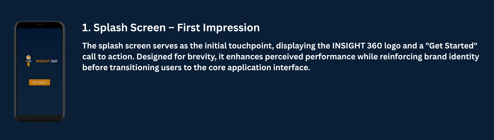
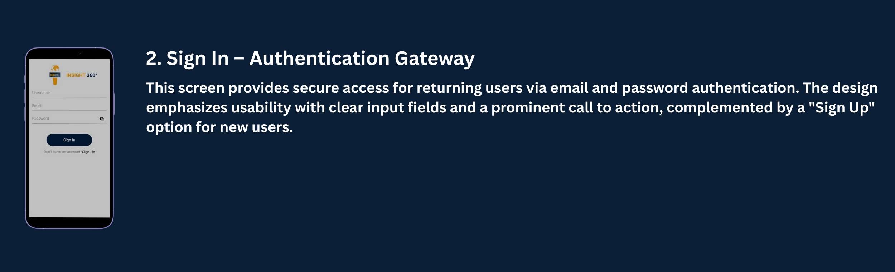
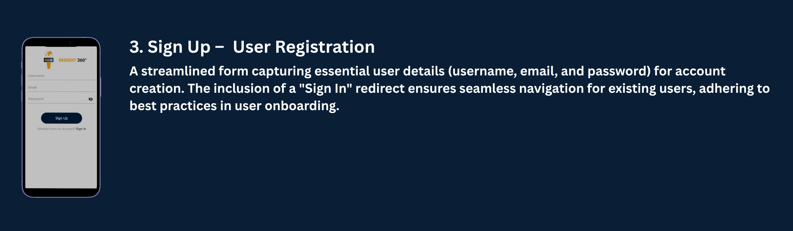
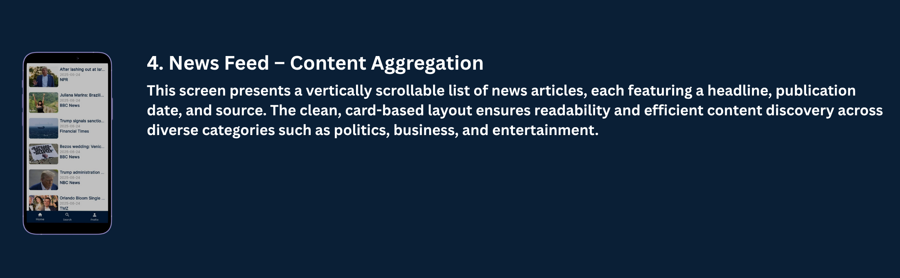
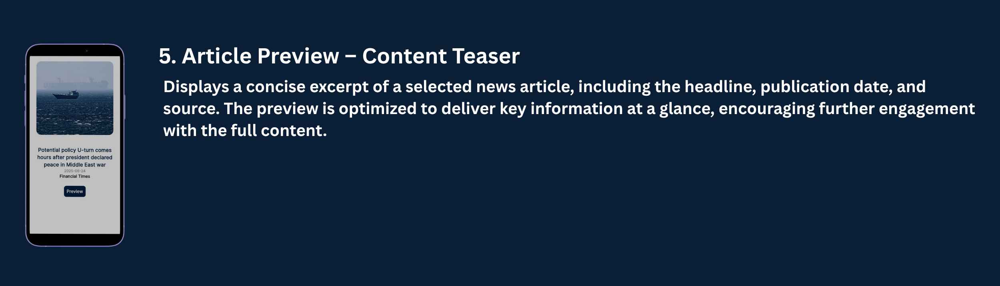
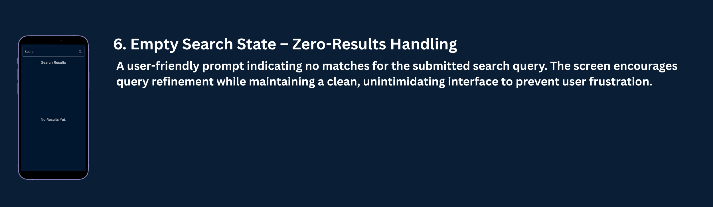
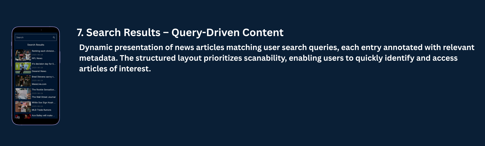
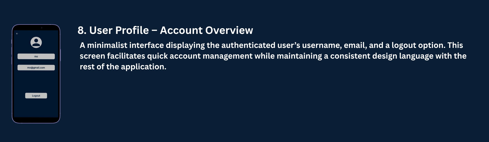

# 📰 News App "Insight 360"

## 🌟Overview
- This News App delivers the latest news articles across various categories with a 
  clean, user-friendly interface.

 <p align="center">
  
</p>


## ✨Views
🎨 Splash View
  - 🖼️ Displays app logo and name
  - ✨ Smooth animation before login/signup

  <p align="center">
  
</p>

** 🔐 Authentication Flow

📲 Sign-In View:
  - 📧 Name, Email and password fields
  - ➡️ "Sign Up" navigation button

  <p align="center">
  
</p>

📝 Sign-Up View:
  - 👤 Name, email, and password fields
  - ↩️ "Already have an account?" option
  - ➡️ "Sign In" navigation button

  <p align="center">
  
</p>

🏠 News Feed
  - 📰 Scrollable news feed (list)
  - 🖼️ Article image, title, short description
  - 🕒 Publication date

  <p align="center">
  
</p>

📖 News Details View
  - 🖼️ Full article with image & text
  - 👤 Article Source & publish date
  - 🔍 "Preview" button

  <p align="center">
  
</p>

🔍 Search View
  - 🔎 Search bar
  - 📋 Filtered results based on category

  <p align="center">
  
</p>

  <p align="center">
  
</p>

👤 Profile View
  - 📛 Username & email
  - 🚪 Logout button

<p align="center">
  
</p>

## 🛠️ Tech Stack

📱 Frontend
- Framework: Flutter
- State Management: Bloc

🌐 Backend
- API: [Rest API]
- Firebase Authentication


## 🏗️ Architecture
  - 🧩 MVVM pattern
  - 📡 REST API integration
  - 💽 Local caching

```
lib/
│
├── core/
│   ├── utils/                        # App-wide utilities (router, styles, service locator, etc.)
│   ├── widgets/                      # Shared/reusable widgets (loading, error, etc.)
│   └── local_storage/
│       ├── local_storage_cubit/      # Cubit and states for local storage
│       └── local_storage_services/   # SharedPreferences service, keys
│
├── features/
│   ├── auth/
│   │   ├── data/                     # Models, repositories, data sources for authentication
│   │   └── presentation/
│   │       ├── manager/              # Cubits, states for auth
│   │       ├── views/                # Auth screens (sign in, sign up, etc.)
│   │       └── widgets/              # Auth-specific widgets (fields, buttons)
│   │
│   ├── home/
│   │   ├── data/
│   │   │   ├── models/               # News/article models
│   │   │   └── repos/                # Home repo implementations
│   │   └── presentation/
│   │       ├── manager/              # Cubits, states for home
│   │       ├── views/                # Home screen
│   │       └── widgets/              # Home widgets (news item, list, etc.)
│   │
│   ├── news_details/
│   │   ├── data/                     # (Optional) Models, repos for details
│   │   └── presentation/
│   │       ├── views/                # News details screen
│   │       └── widgets/              # News details widgets (e.g., news_details_view_body.dart, news_action.dart)
│   │
│   ├── search/
│   │   ├── data/
│   │   │   └── repos/                # Search repo implementations
│   │   └── presentation/
│   │       ├── manager/              # Cubits, states for search
│   │       ├── views/                # Search screen
│   │       └── widgets/              # Search widgets (search field, result list, etc.)
│   │
│   └── profile/
│       ├── data/                     # (Optional) Models, repos for profile
│       └── presentation/
│           ├── manager/              # Cubits, states for profile
│           ├── views/                # Profile screen
│           └── widgets/              # Profile widgets (avatar, info, etc.)
│
├── injection_container.dart          # Dependency injection setup (get_it)
└── main.dart                         # App entry point

assets/
└── images/                           # App images and icons
```

**Key Points:**

- **core/**: Common utilities, local storage services, and shared widgets used across the app.
- **features/**: Each feature (Auth, Home, NewsDetails, Search, Profile) is isolated with its own data and presentation layers.
- **data/**: Contains models and repository implementations for each feature.
- **presentation/manager/**: State management (Cubit/BLoC) for each feature.
- **presentation/views/**: Screens/pages for each feature.
- **presentation/widgets/**: UI components and reusable widgets specific to each feature.
- **assets/**: Static resources such as images and icons.
- **main.dart**: App entry point.
- **injection_container.dart**: Dependency injection setup.

---

**This structure is scalable, modular, and easy to maintain as your app grows.**


  


  


  


  


  
  


  
