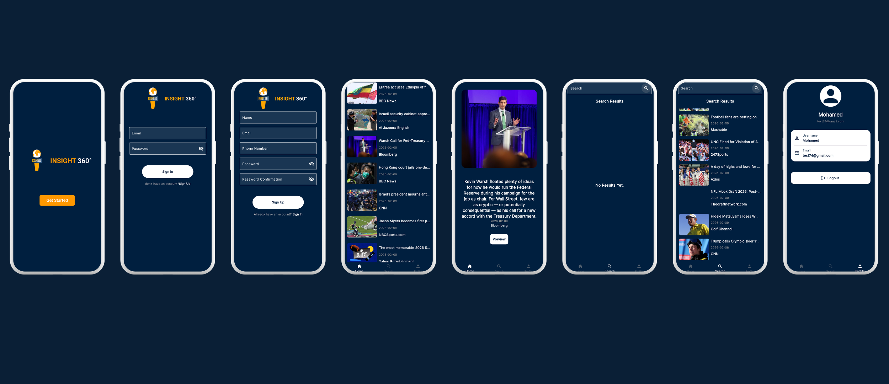
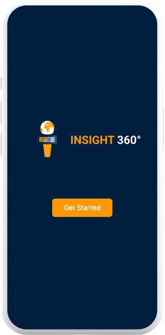
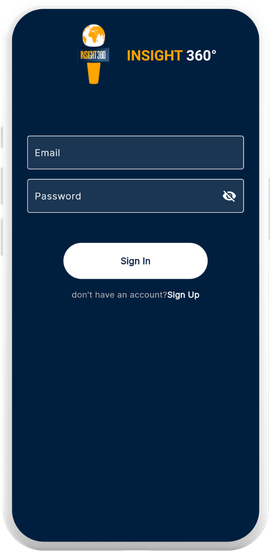
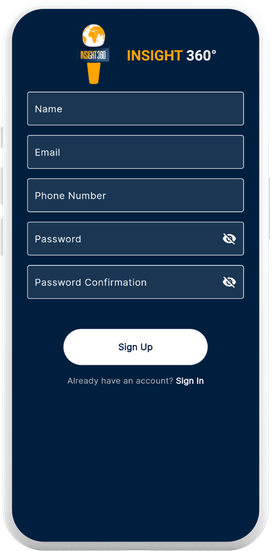
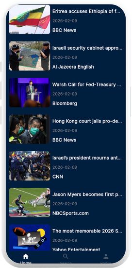
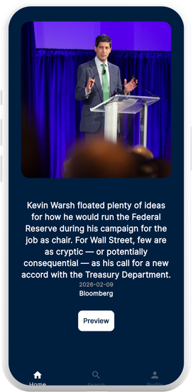
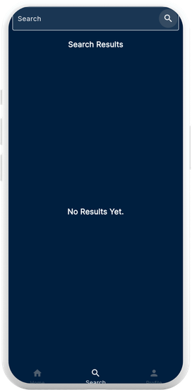
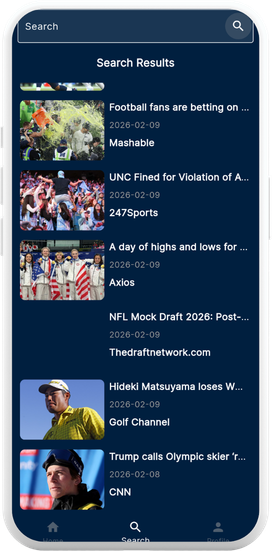
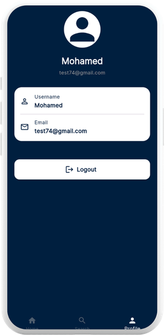

# 🧠 Insight 360°

## 🌟Overview
- A modern mobile app for discovering and exploring global news, featuring:
- 🗞️ Real-time news updates from trusted sources
- ✨ Personalized and category-based article browsing
- 📰 Clean, reader-friendly design for an immersive experience
- 🔍 Smart search to find stories that matter to you


 <p align="center">
  
</p>


## 🎨 Views

🖼️ Onboarding View:
- Displays the Insight 360° logo prominently in the center.
- Features a “Get Started” button that leads to the authentication flow.
- Uses a dark blue and orange theme, creating a professional news-style appearance.

<p align="left">
  
</p>

##

🔐 Login View:
- Includes input fields for Email, and Password.
- Contains a “Sign In” button.
- Provides a redirect link for users without an account: “Don’t have an account? Sign Up.”
- Minimal and clean design following the app’s branding.

<p align="left">
  
</p>

##

📝 Sign-Up View:
- Similar layout to the sign-in view but for new user registration.
- Fields: Name, Email, Phone Number, Password, and Password Confirmation- Bottom has two buttons:
- “Sign Up” button and a link for existing users: “Already have an account? Sign In.”
- Ensures consistent visual identity with sign-in page.
  
<p align="left">
  
</p>

##

🏠 Home View:
- Displays a news feed list with article images, titles, publication dates, and sources (e.g., BBC, NPR).
- Each item represents a clickable news article leading to a detailed view.
- Bottom Navigation Bar provides access to:
- 🏠 Home / 🔍 Search / 👤 Profile
 

<p align="left">
  
</p>

##

📰 News Details View:
- Shows featured article image at the top.
- Displays headline, publication date, and source.
- Contains a Preview button (likely opens full article in browser or detailed reader view).
 

<p align="left">
  
</p>

##

🔍 Search View (Empty State):
- Top search bar allows users to enter keywords.
- Displays a message “No Results Yet.” when no search results are available.
- Dark background consistent with the app theme.
 

<p align="left">
  
</p>

##

📚 Search Results View:
- Same layout as the empty search view but populated with news articles.
- Each result shows:
- Thumbnail image. / Article title. / Source and publication date.
- Scrollable vertical list for multiple results.
 

<p align="left">
  
</p>

##

👤 Profile View:
- Displays a user avatar placeholder at the top.
- Shows username and email address in centered cards.
- Includes a Logout button to end the session.
- Clean, simple layout focused on user info.
 

<p align="left">
  
</p>

## 🛠️ Tech Stack

📱 Frontend
- Framework: Flutter
- State Management: Bloc

🌐 Backend
- API: [Rest API]

## 🏗️ Architecture
  - 🧩 MVVM pattern
  - 📡 REST API integration
  - 💽 Local storage

```
lib/
│
├── core/
│   ├── utils/                        # App-wide utilities (router, styles, service locator, etc.)
│   ├── widgets/                      # Shared/reusable widgets (loading, error, etc.)
│  
├── features/
│   ├── auth/
│   │   ├── data/                     # Models, repositories, data sources for authentication
│   │   └── presentation/
│   │       ├── manager/              # Cubits, states for auth
│   │       ├── views/                # Auth screens (sign in, sign up, etc.)
│   │       └── widgets/              # Auth-specific widgets (fields, buttons)
│   │
│   ├── home/
│   │   ├── data/
│   │   │   ├── models/               # News/article models
│   │   │   └── repos/                # Home repo implementation
│   │   └── presentation/
│   │       ├── manager/              # Cubits, states for home
│   │       ├── views/                # Home screen
│   │       └── widgets/              # Home widgets (news item, list, etc.)
│   │
│   ├── news_details/
│   │   ├── data/                     # (Optional) Models, repos for details
│   │   └── presentation/
│   │       ├── views/                # News details screen
│   │       └── widgets/              # News details widgets (e.g., news_details_view_body.dart, news_action.dart)
│   │
│   ├── search/
│   │   ├── data/
│   │   │   └── repos/                # Search repo implementations
│   │   └── presentation/
│   │       ├── manager/              # Cubits, states for search
│   │       ├── views/                # Search screen
│   │       └── widgets/              # Search widgets (search field, result list, etc.)
│   │
│   └── profile/
│       ├── data/                     # (Optional) Models, repos for profile
│       └── presentation/
│           ├── manager/              # Cubits, states for profile
│           ├── views/                # Profile screen
│           └── widgets/              # Profile widgets (avatar, info, etc.)
│
└── main.dart                         # App entry point

assets/
└── images/                           # App images and icons
```

**Key Points:**

- **core/**: Common utilities, local storage services, and shared widgets used across the app.
- **features/**: Each feature (Auth, Home, NewsDetails, Search, Profile) is isolated with its own data and presentation layers.
- **data/**: Contains models and repository implementations for each feature.
- **presentation/manager/**: State management (Cubit/BLoC) for each feature.
- **presentation/views/**: Screens/pages for each feature.
- **presentation/widgets/**: UI components and reusable widgets specific to each feature.
- **assets/**: Static resources such as images and icons.
- **main.dart**: App entry point.
- **injection_container.dart**: Dependency injection setup.

---

**This structure is scalable, modular, and easy to maintain as your app grows.**


  


  


  


  


  
  


  
